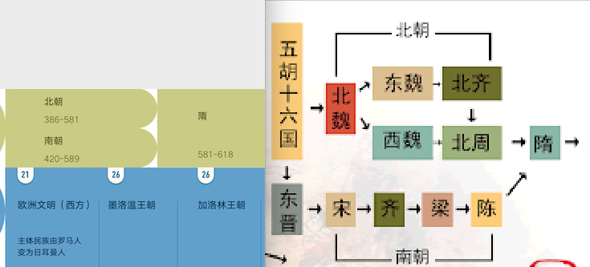

# 开发日志 2020-07-01

核心组件:

## 朝代组件设计思考

历史朝代同时包含了两个维度，时间维度和空间维度，这让建模增加了难度。

时间维度是可以多个政权并行的，但是空间维度是一种此消彼长的关系，一朝可能没有完全取代另一朝。

怎样定义数据及可视化是一个挑战，大小上要呈现时间上的量化，位置上要呈现空间上的政权更替。

用一维结构去定义是比较困难的，用嵌套结构来定义比较好实现。

从图中可以看到，隋朝的大一统是吞并了陈和北周完成的，但是这中间是有时间交叠的，严格按照逻辑隋朝应该和南朝并列，但是这样画出来的图不符合我们的直观印象，所以在视觉设计上还要有一部分重叠的考虑。

如果直接串改朝代起始年代是我不想的，计算机建模如果和真实世界是直接冲突的，那在后续的扩展中可能会出现一些始料未及的问题，我想的解决方案是给隋朝设置一个视觉偏差值，让它向上偏差和陈重叠。

朝代组件在这个超级笔记项目中只起到一个参考系的作用，不想把历史专研的太细，他是为了事件、人、书这些主体服务的。

## 事件

## 人

## 书
