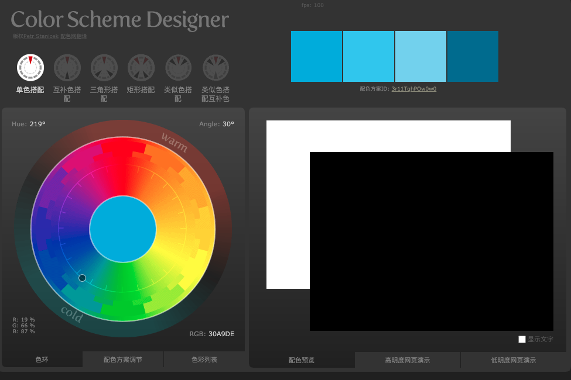

# 开发日志 2020-07-03

今天去找了配色。

一般的网站不会用太多颜色，这是一本超级笔记，希望用多一些的颜色，来区分不同的内容。

https://www.webdesignrankings.com/resources/lolcolors/

再搭配一个调色盘工具: http://www.peise.net/tools/web/

时间轴是浅蓝色 #30A9DE

中国用了中国红 #E53A40

欧洲用了欧盟 🇪🇺旗的深蓝色 #27309A

偶然间发现一个宝库，这里涵盖了从公元前3000年到现在的全世界的画作: https://www.allhistory.com/painting
