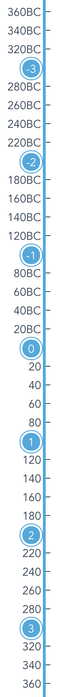

# 开发日志 2020-07-04

> 时间轴组件文档

## 参数说明

| Prop          | Data Type | Options | Default          | Description                                    |
|---------------|-----------|---------|------------------|------------------------------------------------|
| startTime     | Number    | -       | -1600            | 开始时间年份                                   |
| endTime       | Number    | -       | current year + 1 | 结束时间年份                                   |
| step          | Number    | -       | 100              | 大节点，默认 100 年                            |
| space         | Number    | -       | 10               | 小节点，默认 10 年，注意小节点需要能整除大节点 |
| scale         | Number    | -       | 10               | 比例，一年/像素高度                            |
| isShowTooltip | Boolean   | -       | true             | 大节点 hover 时是否展示 Tooltip                |

```js
<TimeLine class="time-line" :scale="1" :space="20"/>
```


