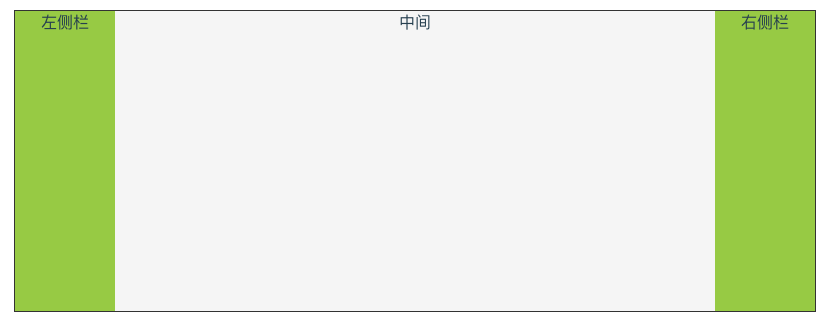

## 第一步、三栏布局

是用 flex 做一个三栏布局。

HTML 结构:
```html
<section class="fixed-layout-container">
  <div class="left">左侧栏</div>
  <div class="middle">中间</div>
  <div class="right">右侧栏</div>
</section>
```

Less:

```less
.fixed-layout-container {
  display: flex;
  width: 800px;
  height: 300px;
  margin: 0 auto;
  border: solid 1px #333;
  background: #666;
  text-align: center;
  .left,
  .right {
    flex: 0 0 100px;
    background: yellowgreen;
  }
  .middle {
    flex: 1;
    background: whitesmoke;
  }
}
```



## 第二步、分区滚动布局

HTML 结构:
```html
<section class="fixed-layout-container2">
  <div class="left">
    <header>Header</header>
    <section>
      <div class="content-item" v-for="item in rows" :key="`left-${item}`">C{{item}}</div>
    </section>
  </div>
  <div class="middle">
    <header>
      <div class="content-item" v-for="item in columns" :key="`middle-header-${item}`">
        H{{item}}
      </div>
    </header>
    <section>
      <div v-for="row in rows" :key="`middle-${row}`">
        <div class="content-item" v-for="column in columns" :key="`middle-header-${column}`">
          C{{row}}H{{column}}
        </div>
      </div>
    </section>
  </div>
  <div class="right">
    <header>Header</header>
    <section>
      <div class="content-item" v-for="item in rows" :key="`right-${item}`">C{{item}}</div>
    </section>
  </div>
</section>
```

用到的一点自动生成的数据:
```js
data() {
  const columns = [];
  const rows = [];
  for (let i = 1; i < 11; i++) {
    columns.push(i);
  }
  for (let i = 1; i < 16; i++) {
    rows.push(i);
  }
  return {
    columns,
    rows
  }
},
```

Less:
```less
.fixed-layout-container {
  display: flex;
  width: 800px;
  height: 300px;
  margin: 0 auto;
  border: solid 1px #333;
  background: #666;
  text-align: center;
  .left,
  .right {
    flex: 0 0 100px;
    background: yellowgreen;
  }
  .middle {
    flex: 1;
    background: whitesmoke;
    > header {
      display: flex;
      flex-direction: row;
      max-width: 590px;
      overflow: auto;
    }
    > section {
      max-width: 590px;
      > div {
        display: flex;
        .content-item {
          margin-bottom: 0;
        }
      }
    }
  }
  .left,
  .right,
  .middle {
    @header-height: 30px;
    display: flex;
    flex-direction: column;
    > header {
      flex: 0 0 @header-height;
      line-height: @header-height;
      margin: 5px;
      overflow: auto;
      background: #4F86C6;
      text-align: center;
    }
    > section {
      flex: 1;
      margin: 5px;
      padding-bottom: 5px;
      overflow: auto;
      background: #4FB0C6;
    }
  }

  .content-item {
    margin: 5px;
    min-width: 80px;
    line-height: 20px;
    color: #fff;
    background: #379392;
  }
}
```


左右侧栏头部区域固定，内容上下滚动；中间头部区域上下固定左右可滚动，内容区可上下左右滚动。在 flex 分割出的三列中，需要将中间一列设置最大宽度，这样才能限制水平方向的内容出现在预定的范围内，这里用的是 590px 这个固定值，实际场景中需要动态取计算，计算规则是:`外层容器宽度减 - 左侧边固定宽度 - 右侧边固定宽度`。

## 第三步、同步滚动条位置

只做 chrome 的兼容，通过 wheel 事件，鼠标横向和纵向通过 event.wheelDeltaX 和 event.wheelDeltaY 来判断，再通过 event.preventDefault() 来屏蔽默认事件。

为了方便给 Dom 设置 ref 属性:

```html
<section class="fixed-layout-container3" ref="fixedLayoutContainer">
  <div class="left">
    <header>Header</header>
    <section ref="fixedLayoutLeftContent">
      <div class="content-item" v-for="item in rows" :key="`left-${item}`">C{{item}}</div>
    </section>
  </div>
  <div class="middle">
    <header ref="fixedLayoutMiddleHeader">
      <div class="content-item" v-for="item in columns" :key="`middle-header-${item}`">
        H{{item}}
      </div>
    </header>
    <section ref="fixedLayoutMiddleContent">
      <div v-for="row in rows" :key="`middle-${row}`">
        <div class="content-item" v-for="column in columns" :key="`middle-header-${column}`">
          C{{row}}H{{column}}
        </div>
      </div>
    </section>
  </div>
  <div class="right">
    <header>Header</header>
    <section ref="fixedLayoutRightContent">
      <div class="content-item" v-for="item in rows" :key="`right-${item}`">C{{item}}</div>
    </section>
  </div>
</section>
```

js 同步滚动条位置:

```js
mounted() {
  const thisObj = this;
  const middleHeader = thisObj.$refs.fixedLayoutMiddleHeader;
  const middleContent = thisObj.$refs.fixedLayoutMiddleContent;
  const maxScrollLeft = middleContent.scrollWidth - middleContent.offsetWidth;
  const maxScrollTop = middleContent.scrollHeight - middleContent.offsetHeight;
  this.$refs.fixedLayoutContainer.addEventListener('wheel', event => {

    // 横向滚动，中间部分的头部和内容滚动
    if (event.wheelDeltaX) {
      let scrollLeft = this.scrollLeft - (event.wheelDeltaX / 3)
      this.scrollLeft = scrollLeft > maxScrollLeft ? maxScrollLeft : scrollLeft;
      middleHeader.scrollTo(this.scrollLeft, 0);
      middleContent.scrollTo(this.scrollLeft - 1, this.scrollTop);
    }
    // 纵向滚动，左中右的内容区
    if (event.wheelDeltaX) {
      let scrollTop = this.scrollTop - (event.wheelDeltaY / 3);
      this.scrollTop = scrollTop > maxScrollTop ? maxScrollTop : scrollTop;
      middleContent.scrollTo(this.scrollLeft, this.scrollTop - 1);
      thisObj.$refs.fixedLayoutLeftContent.scrollTo(this.scrollLeft, this.scrollTop - 1);
      thisObj.$refs.fixedLayoutRightContent.scrollTo(this.scrollLeft, this.scrollTop - 1);
    }

    event.preventDefault();
  });
}
```

将上面的 `overflow: auto;` 换成 `overflow: hidden;`，没有了滚动条的界面成为一个完整的布局。至此功能就完成了，应用的时候只让中间内容区和右侧内容区的滚动条出现，根据左右两边有遮挡再加一些阴影的修饰。
